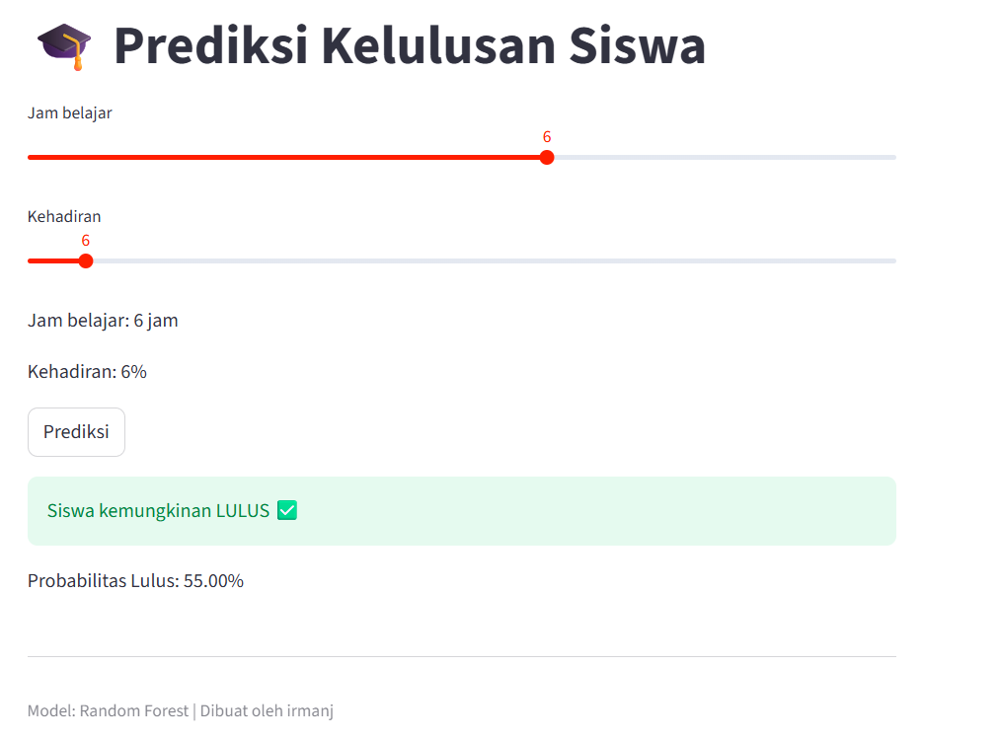

# 🎓 Student Graduation Prediction
Project ini mensimulasikan sistem prediksi performa siswa yang bisa digunakan sebagai early warning system di dunia pendidikan.

## 📌 Problem
Memprediksi apakah siswa akan lulus berdasarkan jam belajar dan kehadiran.

## 📊 Dataset
Dataset sederhana dengan fitur:
- Jam belajar
- Kehadiran

## ⚙️ Model
- Random Forest Classifier

## 📈 Hasil
- Accuracy: 0.85 (contoh)

## 🚀 Tech Stack
- Python
- Scikit-learn
- Pandas
- Matplotlib

## 📂 Struktur Project
- main.py
- data.csv
- model.pkl

## 🌐 Demo Aplikasi
Aplikasi web untuk memprediksi kelulusan siswa menggunakan Machine Learning.

## 📷 Tampilan Aplikasi

## ⚙️ Fitur
- Input jam belajar & kehadiran
- Prediksi kelulusan
- Probabilitas hasil